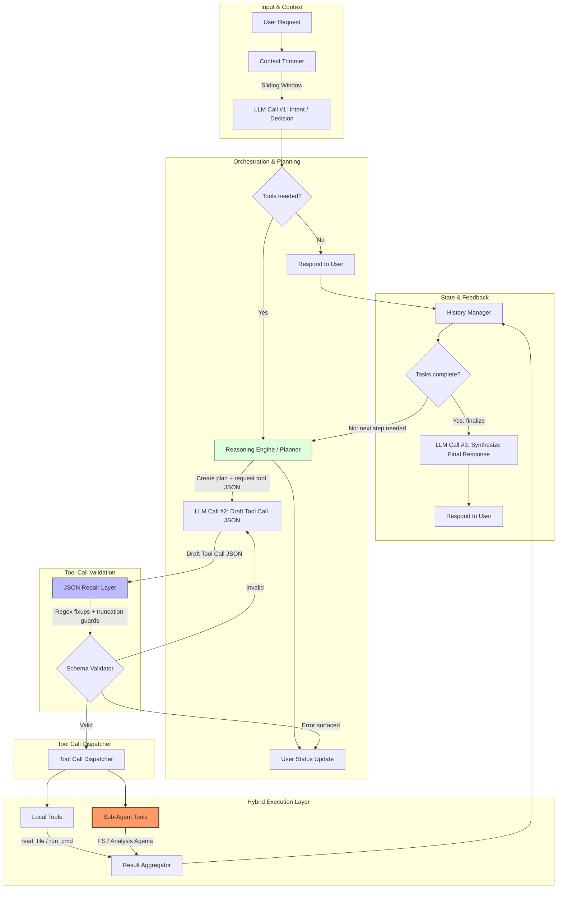

# Agent Workflow

This document describes the step-by-step workflow of the AI Coding Agent when processing a user query.

## Technical Architecture (for Software Engineers)

## Detailed Steps

1.  **User Input**: The process starts when the user enters a query in the terminal or UI.
2.  **Context Management**: The agent trims the message history to fit within token limits while preserving the system prompt and recent context.
3.  **Thinking Phase**: The agent sends the current conversation history and tool definitions to the LLM (defaulting to Gemini 3.0 Flash via OpenRouter).
4.  **Reasoning (Planning)**: If the LLM decides to use tools, the agent first asks for a concise 1-sentence explanation of the plan to keep the user informed.
5.  **Tool Execution**:
    *   **JSON Repair**: The agent automatically fixes common LLM output issues like truncated JSON or missing closing braces.
    *   **Validation**: Basic checks ensure required parameters (like `path` and `content` for `write_file`) are present.
    *   **Hybrid Architecture**: 
        *   **Local Tools**: Simple operations like `read_file` or `run_command` are executed directly.
        *   **Sub-Agents**: Context-heavy "⚡ Heavy operations" (like `explore_codebase`) are delegated to specialized sub-agents (`FileSystemAgent`, `AnalysisAgent`) that have their own optimized prompts and logic.
6.  **Status Updates**: Throughout the process, the agent emits status events (`thinking`, `running_tools`, `summarizing`) which are reflected in the UI.
7.  **Looping**: After tool execution, the results are added back to the history, and the agent asks the LLM for the next step. This continues until the LLM provides a final text response.
8.  **Final Response**: The agent renders the final response (supporting Markdown) and returns to an idle state, ready for the next user query.
