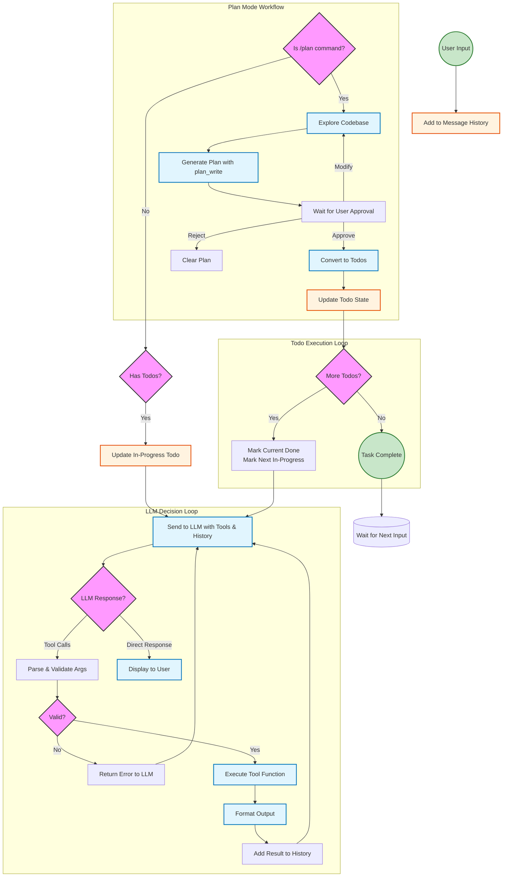

# Agent Decision Process Flowchart

## Mermaid Source Code



## Component Breakdown

### 1. User Input → Message History
When user input is received, it's added to the conversation history for context.

### 2. Plan Mode Detection
- **Check for `/plan` command**: If user wants to create an implementation plan
- **Explore codebase**: Gather context about the project
- **Generate plan**: Create structured plan with `plan_write` tool
- **Wait for approval**: User can approve, reject, or request modifications
- **Convert to todos**: Approved plans become todo items

### 3. Todo State Management
- **Check for existing todos**: If tasks are pending
- **Update in-progress todo**: Track which task is being worked on
- **Todo loop**: Continue executing until all todos are complete

### 4. LLM Decision Loop (Core Agent Logic)
The agent repeatedly:
1. **Sends to LLM**: User message + history + available tools
2. **LLM decides**: Either make tool calls OR respond directly
3. **If tool calls**:
   - Parse & validate arguments
   - Execute tool function
   - Format output
   - Add result to history
   - Loop back to LLM
4. **If direct response**: Display to user

### 5. Available Tools (30+ tools)
- **File Operations**: read_file, write_file, edit_file, patch_file, list_files
- **Testing**: run_tests, analyze_test_failures, get_coverage, generate_tests
- **Code Analysis**: detect_changed_files, analyze_coverage_gaps
- **Planning**: todo_write, plan_write, extract_tasks_from_prd
- **Diagrams**: generate_mermaid_diagram
- **And more**: run_command, scaffold, LSP, sub-agents

## Key Decision Points

| Decision | Condition | Next Step |
|----------|-----------|-----------|
| Plan mode? | `/plan` command detected | Enter plan workflow |
| Has todos? | Uncompleted tasks exist | Update and execute |
| LLM response type | Tool calls or direct text | Execute tools or display |
| Args valid? | JSON parsing succeeds | Execute or return error |
| More todos? | Tasks remaining | Mark next in-progress |
| Task complete? | All todos done | Wait for next input |

## Architecture Components

```
┌─────────────────────────────────────────────────────────┐
│                    AIAgentCore                          │
│  ┌─────────────────┐  ┌─────────────────────────────┐  │
│  │ TodoStateManager│  │      PlanStateManager       │  │
│  └────────┬────────┘  └─────────────┬───────────────┘  │
│           │                        │                  │
│  ┌────────▼────────┐  ┌─────────────▼───────────────┐  │
│  │MessageHistoryMgr│  │       ToolExecutor          │  │
│  └────────┬────────┘  │  ┌───────────────────────┐  │  │
│           │           │  │ CompletionService     │  │  │
│  ┌────────▼────────┐  │  └───────────────────────┘  │  │
│  │  Tool Output    │  └─────────────────────────────┘  │
│  │   Formatter     │                                    │
│  └─────────────────┘                                   │
└─────────────────────────────────────────────────────────┘
```

## Color Legend

- 🔷 **Blue**: Process nodes (actions taken)
- 🔶 **Orange**: Data nodes (state storage)
- 🟢 **Green**: Start/End nodes
- 🩷 **Pink**: Decision nodes (branching logic)
