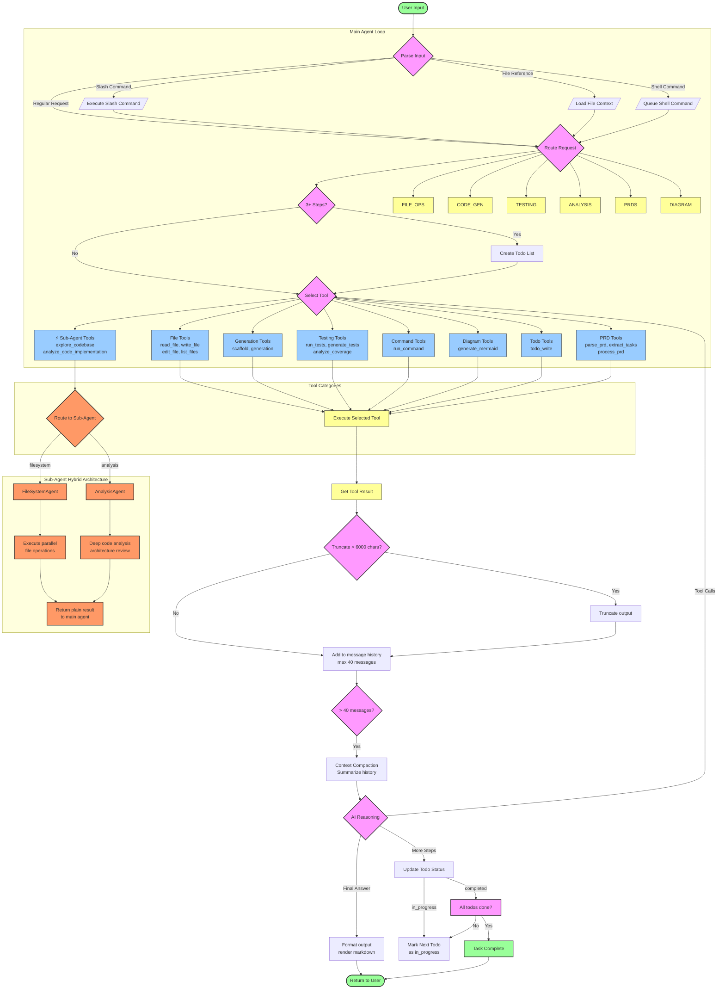

# Coding Agent Decision Workflow

## Workflow Summary

### 1. Input Parsing & Routing
- **Slash Commands** (`/test`, `/diagram`, etc.)
- **File References** (`@file.ts`)
- **Shell Commands** (`!npm install`)
- **Regular Requests** → routed to appropriate handler

### 2. Todo-Driven Multi-Step Tasks
- For tasks with 3+ steps, automatically creates todo list
- Only ONE todo can be "in_progress" at a time
- Updates status as tasks complete

### 3. Tool Categories (8 categories, 20+ tools)
| Category | Tools |
|----------|-------|
| **File Tools** | read_file, write_file, edit_file, patch_file, list_files |
| **Generation** | scaffold, generate_mermaid, generate_tests, generate_regression_test |
| **Testing** | run_tests, analyze_test_failures, get_coverage, analyze_coverage_gaps |
| **Commands** | run_command |
| **PRD** | parse_prd, extract_tasks_from_prd, process_prd_with_tasks |
| **Todo** | todo_write |
| **Sub-Agents** | explore_codebase, analyze_code_implementation, bulk_file_operations |

### 4. Hybrid Sub-Agent Architecture
- **FileSystemAgent**: Parallel file exploration, multi-file operations
- **AnalysisAgent**: Deep architectural analysis, PRD parsing
- Lightweight wrapper around LLM calls (claude-sonnet-4.5)

### 5. Context Management
- Max 40 messages in history (~20 exchanges)
- Automatic context compaction when limit reached
- Output truncation at 6000 characters

### 6. Decision Points
1. **Input Type Detection** → Route to appropriate handler
2. **Todo Check** → Create todo list for complex tasks
3. **Tool Selection** → Choose from 8 tool categories
4. **Output Truncation** → Prevent token overflow
5. **History Check** → Trigger context compaction
6. **AI Reasoning** → Tool call loop or final response
7. **Todo Completion** → Mark next task or complete

### 7. API Integration
- Uses OpenRouter API with fallback models (minimax, claude-sonnet-4.5)
- 2-minute timeout on API calls
- Streaming disabled by default (conflicts with Ink UI)
